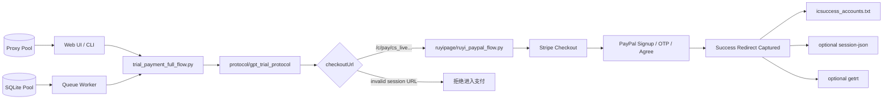

# GPT-FULL-REGIST AND PAYMENT-FLOW

<p align="center">
  <b>GPT 协议注册 + Stripe/PayPal 支付 + session-json/getrt 导出的一体化全流程系统</b>
</p>

<p align="center">
  <a href="https://github.com/huverse/GPT-FULL-REGIST-AND-PAYMENT-FLOW"></a>
  
  
  
  
  
</p>

<p align="center">
  <b>中文文档</b> ｜ <a href="#english-guide">English Guide</a>
</p>

---

## 项目定位（经过修改后可用于日区Paypal，自行二次开发（本版本测试支持日本Paypal），已确认可行）（上一个版本是稳定版美区PP，现在的是不稳定日本PP，自己选择，建议回滚拿美国的自己改）
（Paypal渠道拉闸，本注册机目前能全流程成功，但是OpenAI疑似会延迟检测PP状态，而目前的PP渠道所注册的PP会秒封，所以本项目目前已没有产号价值，可用于学习研究）

`GPT-FULL-REGIST AND PAYMENT-FLOW` 是一个完整的、可部署的全流程自动化项目（全协议注册+无头支付+协议Oauth）。它把 GPT 账号协议注册、OpenAI hosted checkout 获取、Stripe/PayPal 支付、成功账号归档、可选 session-json 导出、可选 Codex OAuth getrt 导出串成一条可观测、可并发、可 Web 管理的流水线。

核心目标：

```text
输入邮箱 / 卡 / 短信接口 / 代理配置
        ↓
协议注册并生成 checkoutUrl
        ↓
Stripe hosted checkout 选择 PayPal
        ↓
PayPal signup / SMS OTP / final Agree
        ↓
捕获成功支付回跳
        ↓
写入成功账号 + 可选导出 session-json/getrt
```

本仓库包含完整运行所需的主流程代码、协议注册机、支付自动化、队列并发、资源池、代理池、Web 管理面板和调试工具。运行时账号池、卡池、短信接口、代理凭据、浏览器内核压缩包等私有运行数据不会提交，需要使用者按自己的环境配置。

---

## 功能亮点

| 模块 | 能力 |
| --- | --- |
| 协议注册机 | 注册/登录、邮箱验证码、OpenAI checkoutUrl 生成、协议 trace 输出 |
| 支付自动化 | Stripe hosted checkout、PayPal 选择、PayPal signup、SMS OTP、final Agree |
| 成功判定 | 基于 Stripe/OpenAI 明确成功回跳，不依赖宽松页面文本 |
| DataDome 处理 | CSS bypass、本地 ruyi/DDC slider、`t=bv` blocked verdict 快速识别 |
| getrt | Codex OAuth PKCE、email OTP、可选 add-phone、CPA/sub2/codex/raw 输出 |
| session-json | 支付成功后可选导出，默认支持 CPA 格式 |
| 资源池 | SQLite 管理 email/card/phone，支持 retry/failed/批量操作 |
| 并发队列 | worker 并发、目标成功数、支付浏览器 slot 控制、子任务日志聚合 |
| Web UI | 中文控制台、单次运行、并发任务、实时日志、资源池、代理池 |
| 有头调试 | Xvfb + x11vnc + SSH tunnel，本地可观察服务器浏览器 |

---

## 系统架构



松耦合边界：

- 协议机不 import 支付机。
- 支付机不 import 协议机。
- getrt 通过 subprocess 调用。
- Web UI 只启动编排器/队列 worker，不把业务逻辑塞进前端服务。

---

## 目录结构

```text
.
├── trial_payment_full_flow.py          # 单账号全流程编排器
├── run_trial_payment_full_flow.sh      # 单账号入口
├── full_flow_web.py                    # 中文 Web 控制台
├── run_full_flow_web.sh                # Web 控制台入口
├── full_flow_queue_worker.py           # 并发队列 worker
├── run_full_flow_queue_worker.sh       # 并发队列入口
├── full_flow_pool.py                   # SQLite email/card/phone 资源池
├── full_flow_proxy_pool.py             # 代理池与代理测试
├── full_flow_concurrency_goal_runner.py# 并发达标测试工具
├── protocol/gpt_trial_protocol/        # 协议注册机
├── ruyipage/                           # ruyiPage + Stripe/PayPal 支付自动化
├── getrt/                              # Codex OAuth getrt
├── debug/headed_payment/               # 有头调试工具
├── firefox-fingerprintBrowser/         # 指纹 Firefox 放置目录
├── full_flow.env.example               # 全流程配置模板
└── FULL_FLOW_INTEGRATION.md            # 集成细节说明
```

---

## 运行环境

推荐：

- Linux 服务器
- Python 3.10+
- Node.js
- curl / git / tar / xz
- 可访问目标站点的网络环境
- 邮箱验证码接口
- SMS OTP 接口
- 支付卡数据
- 可选：支付/协议代理
- 可选：2Captcha API key

安装系统依赖：

```bash
sudo apt-get update
sudo apt-get install -y python3 python3-venv python3-pip nodejs npm curl git xz-utils
```

---

## 快速安装

```bash
git clone https://github.com/huverse/GPT-FULL-REGIST-AND-PAYMENT-FLOW.git
cd GPT-FULL-REGIST-AND-PAYMENT-FLOW
```

支付机需要兼容的 Linux 指纹 Firefox。将浏览器压缩包放到：

```text
firefox-fingerprintBrowser/downloads/
```

文件名示例：

```text
firefox-xxx.linux-x86_64.tar.xz
```

然后执行：

```bash
./deploy_server.sh
```

脚本会创建：

```text
protocol/gpt_trial_protocol/.venv
ruyipage/.venv
full_flow.env
ruyipage/.env
```

---

## 配置说明

### `full_flow.env`

复制模板：

```bash
cp full_flow.env.example full_flow.env
```

常用配置：

```bash
# 协议注册代理；不使用代理可设 direct。
GPT_TRIAL_PROXY=direct

# SQLite 资源池。
FULL_FLOW_POOL_DB=accfile/pool/full_flow.sqlite3

# Web 控制台。
FULL_FLOW_WEB_HOST=0.0.0.0
FULL_FLOW_WEB_PORT=8765

# 支付浏览器并发槽位。
FULL_FLOW_PAYMENT_BROWSER_SLOTS=2

# DataDome t=bv 后临时支付代理重试一次。
PAYMENT_TEMP_PROXY_ENABLED=0
PAYMENT_TEMP_PROXY=proxy-host:port:user:pass(socks)

# 支付阶段从一开始就使用代理。
PAYMENT_PROXY_ENABLED=0
PAYMENT_PROXY=proxy-host:port:user:pass(http)
PAYMENT_PROXY_USE_BRIDGE=1
```

### `ruyipage/.env`

复制模板：

```bash
cp ruyipage/.env.example ruyipage/.env
```

常用配置：

```bash
APIKEY_2CAPTCHA=
RUYI_PROXY_CHAIN_UPSTREAM=
RUYI_PROXY_CHAIN_VIA=direct
RUYI_FIREFOX_PATH=
```

### 协议机配置

协议机位于：

```text
protocol/gpt_trial_protocol/
```

可参考：

```text
protocol/gpt_trial_protocol/.env.example
protocol/gpt_trial_protocol/CONFIGURATION.md
```

正常全流程运行时，不需要手动启动协议机；编排器会通过 CLI/subprocess 调用它。

公开版不内置任何私有邮箱验证码接口，也不会默认请求任何作者自用服务。开发者必须配置自己的邮箱验证码服务：

```bash
GPT_TRIAL_EMAIL_CODE_BASE_URL=https://your-email-code.example
GPT_TRIAL_EMAIL_CODE_PROVIDER=auto
GPT_TRIAL_CUSTOM_EMAIL_DOMAIN=example-mail.invalid
```

当前内置的是两种通用 JSON 适配形态：

```text
extract_json:
  GET <base>/api/v1/extract?email=...&refresh=1&limit=20
  response: {"ok": true, "email": "...", "latestCode": "123456", "latest": {"date": "..."}}

openai_code_json:
  GET <base>/v1/openai-code?recipient=...
  response: {"recipient": "...", "code": "123456", "receivedAt": "..."}
```

---

## 单账号全流程（支持并发和队列，在后面说明）

### 使用已有邮箱

```bash
./run_trial_payment_full_flow.sh \
  --email "user@example.com" \
  --email-type "icloud" \
  --email-code-provider "extract_json" \
  --email-code-base-url "https://your-email-code.example" \
  --card-line "4111 1111 1111 1111 02/30 123" \
  --sms-line "+1xxxxxxxxxx----https://sms-api.example/path"
```

### 自动生成邮箱

```bash
./run_trial_payment_full_flow.sh \
  --generate-email \
  --email-type "custom" \
  --email-code-provider "openai_code_json" \
  --email-code-base-url "https://your-email-code.example" \
  --card-line "4111 1111 1111 1111 02/30 123" \
  --sms-line "+1xxxxxxxxxx----https://sms-api.example/path"
```

### 导出 session-json

```bash
./run_trial_payment_full_flow.sh \
  --email "user@example.com" \
  --email-type "icloud" \
  --email-code-provider "extract_json" \
  --email-code-base-url "https://your-email-code.example" \
  --card-line "4111 1111 1111 1111 02/30 123" \
  --sms-line "+1xxxxxxxxxx----https://sms-api.example/path" \
  --enable-session-json \
  --session-json-format cpa
```

### 导出 getrt / refresh_token

```bash
./run_trial_payment_full_flow.sh \
  --email "user@example.com" \
  --email-type "icloud" \
  --email-code-provider "extract_json" \
  --email-code-base-url "https://your-email-code.example" \
  --card-line "4111 1111 1111 1111 02/30 123" \
  --sms-line "+1xxxxxxxxxx----https://sms-api.example/path" \
  --enable-getrt \
  --getrt-output-format cpa
```

OAuth 需要补手机号时：

```bash
./run_trial_payment_full_flow.sh \
  --email "user@example.com" \
  --email-type "icloud" \
  --email-code-provider "extract_json" \
  --email-code-base-url "https://your-email-code.example" \
  --card-line "4111 1111 1111 1111 02/30 123" \
  --sms-line "+1xxxxxxxxxx----https://payment-sms-api.example/path" \
  --enable-getrt \
  --enable-getrt-add-phone \
  --getrt-phone-line "+1yyyyyyyyyy----https://oauth-sms-api.example/path"
```

---

## Web 控制台

启动：

```bash
./run_full_flow_web.sh \
  --pool-db accfile/pool/full_flow.sqlite3 \
  --host 0.0.0.0 \
  --port 8765
```

浏览器打开：

```text
http://SERVER_IP:8765/
```

Web UI 支持：

- 单账号启动
- 资源池任务启动
- 并发 worker
- 目标成功数
- 实时日志刷新
- 动态日志文件列表
- 队列父任务和子任务展示
- 邮箱/卡/手机号池管理
- 失败邮箱查看、恢复、删除
- 批量删除、批量转重试
- 代理池新增、删除、注册测试、支付测试

`webui.log` 只存在于 Web 父任务。CLI 任务或队列子任务通常只有：

```text
summary.json
protocol.log
payment.log
payment_result.json
```

Web UI 会按 run 实际存在的文件动态展示日志按钮。

---

## 资源池与并发

资源池默认使用 SQLite：

```text
accfile/pool/full_flow.sqlite3
```

资源类型：

| 类型 | 说明 |
| --- | --- |
| email | GPT 注册邮箱 |
| card | 支付卡 |
| phone | 支付短信手机号/API |

邮箱池分组：

| 分组 | 含义 |
| --- | --- |
| main | 主池 |
| retry | 预备/重试池 |
| failed | 失败池 |

拒绝卡类错误会进入 retry。重试时会：

- 使用同一个 GPT 邮箱；
- 换卡；
- 重新生成 PayPal signup 邮箱；
- 不强制换手机号。

### 队列运行

n 并发运行，实际可按资源和浏览器稳定性逐步扩展到 8 并发。

```bash
./run_full_flow_queue_worker.sh \
  --pool-db accfile/pool/full_flow.sqlite3 \
  --workers 2 \
  --max-runs 2
```

3 并发，目标成功 3 个，最多启动 6 个：

```bash
./run_full_flow_queue_worker.sh \
  --pool-db accfile/pool/full_flow.sqlite3 \
  --workers 3 \
  --success-target 3 \
  --max-runs 6
```

并发策略：

```text
协议阶段：按 worker 并发
支付阶段：受 FULL_FLOW_PAYMENT_BROWSER_SLOTS 限制
Firefox 启动：短锁串行，避免 backend 连接失败
```

---

## 输出文件

每次运行生成：

```text
runtime/full_flow/<run_id>/
```

常见文件：

```text
summary.json
protocol.log
protocol_results.jsonl
payment.log
payment_result.json
webui.log                  # 仅 Web 父任务
getrt.log                  # 启用 getrt 时
getrt_result.json          # 启用 getrt 时
web_session_result.json    # 启用 session-json 时
```

成功账号：

```text
accfile/pwd/icsuccess_accounts.txt
```

格式为一行一个 GPT 邮箱：

```text
user@example.com
```

session-json：

```text
accfile/session_json/<email>.json
```

getrt：

```text
accfile/json/<email>.json
```

CPA 输出结构：

```json
{
  "access_token": "...",
  "account_id": "...",
  "email": "user@example.com",
  "expired": "...",
  "last_refresh": "...",
  "refresh_token": "...",
  "type": "codex"
}
```

---

## 支付成功判定

支付成功只认明确链路信号：

```text
pm-redirects.stripe.com/return/...status=success
pay.openai.com/...redirect_status=succeeded
pay.openai.com/...returned_from_redirect=true
chatgpt.com/payments/success
```

协议阶段返回：

```text
User is already paid
```

会被视为幂等成功：

```text
status=success
reason=already_paid
```

这表示 OpenAI 后端已经确认该账号处于 paid 状态。

---

## DataDome / CAPTCHA

默认顺序：

```text
CSS bypass
  -> 本地 ruyi/DDC slider
  -> 显式启用时才使用 2Captcha
```

如果 DataDome iframe URL 出现：

```text
t=bv
```

表示 blocked verdict，即当前 IP/session 被阻断，不会继续盲拖滑块。

可选配置：

```bash
PAYMENT_TEMP_PROXY_ENABLED=1
PAYMENT_TEMP_PROXY=proxy-host:port:user:pass(socks)
```

效果：

```text
payment direct
  -> 遇到 DataDome t=bv
  -> 使用临时支付代理重试一次
```

---

## 有头调试

工具目录：

```text
debug/headed_payment/
```

本地启动 VNC 隧道：

```bash
SSHPASS='your-ssh-password' ./debug/headed_payment/connect_local.sh
```

本地 VNC Viewer 连接：

```text
127.0.0.1:5901
```

服务器有头运行：

```bash
./debug/headed_payment/run_headed_payment.sh \
  --email "user@example.com" \
  --email-type icloud \
  --email-code-provider extract_json \
  --email-code-base-url "https://your-email-code.example" \
  --card-line "4111 1111 1111 1111 02/30 123" \
  --sms-line "+1xxxxxxxxxx----https://sms-api.example/path"
```

停止虚拟桌面：

```bash
./debug/headed_payment/server_desktop.sh stop
```

---

## 常见问题

### `webui.log not found`

`webui.log` 只存在于 Web 父任务。队列子任务或 CLI 任务通常只有自身阶段日志。新版 Web UI 会动态展示可用日志。

### `Stripe amount check failed`

Stripe 页面金额不是 0，例如 `$20.00`。这是硬失败，不重试当前支付阶段。

### `BrowserConnectError`

ruyi/Firefox backend 启动连接失败。队列模式下先降低：

```bash
FULL_FLOW_PAYMENT_BROWSER_SLOTS=1
```

稳定后再提高到 2/3。

### `DataDome t=bv`

这是 blocked verdict，不是滑块问题。需要更换支付出口或启用临时支付代理。

---

## 开发者约定

建议开发原则：

- 先看日志/抓包/运行证据，再改代码。
- 只修真实失败层。
- 不增加无意义长等待。
- 不使用宽松页面文本替代支付成功回跳。
- 协议、支付、getrt 保持 subprocess 边界。

基础检查：

```bash
python3 -m py_compile \
  trial_payment_full_flow.py \
  full_flow_web.py \
  full_flow_pool.py \
  full_flow_proxy_pool.py \
  full_flow_queue_worker.py \
  getrt/codex_oauth_getrt.py \
  ruyipage/ruyi_paypal_flow.py
```

---

<a id="english-guide"></a>

## English Guide

`GPT-FULL-REGIST AND PAYMENT-FLOW` is a complete automation system for GPT protocol registration, Stripe/PayPal checkout, successful-account archival, optional session-json export, and optional Codex OAuth getrt export.

### Pipeline

```text
email / card / SMS API / proxy config
        ↓
protocol registration and checkoutUrl generation
        ↓
Stripe hosted checkout
        ↓
PayPal signup / SMS OTP / final Agree
        ↓
success redirect capture
        ↓
success account archival + optional session-json/getrt
```

### Modules

```text
protocol/gpt_trial_protocol  # protocol registrar
ruyipage                    # ruyiPage Firefox payment automation
getrt                       # optional Codex OAuth refresh_token exporter
trial_payment_full_flow.py  # orchestrator
full_flow_web.py            # Web console
full_flow_queue_worker.py   # queue worker
```

The modules are loosely coupled. The orchestrator connects them through CLI/subprocess contracts.

### Setup

```bash
sudo apt-get update
sudo apt-get install -y python3 python3-venv python3-pip nodejs npm curl git xz-utils

git clone https://github.com/huverse/GPT-FULL-REGIST-AND-PAYMENT-FLOW.git
cd GPT-FULL-REGIST-AND-PAYMENT-FLOW
```

Place a compatible Linux fingerprint Firefox archive under:

```text
firefox-fingerprintBrowser/downloads/
```

Then run:

```bash
./deploy_server.sh
```

Edit:

```text
full_flow.env
ruyipage/.env
```

### Single Run

```bash
./run_trial_payment_full_flow.sh \
  --email "user@example.com" \
  --email-type "icloud" \
  --email-code-provider "extract_json" \
  --email-code-base-url "https://your-email-code.example" \
  --card-line "4111 1111 1111 1111 02/30 123" \
  --sms-line "+1xxxxxxxxxx----https://sms-api.example/path"
```

Enable session-json:

```bash
--enable-session-json --session-json-format cpa
```

Enable getrt:

```bash
--enable-getrt --getrt-output-format cpa
```

Enable OAuth add-phone for getrt:

```bash
--enable-getrt-add-phone \
--getrt-phone-line "+1yyyyyyyyyy----https://oauth-sms-api.example/path"
```

### Web UI

```bash
./run_full_flow_web.sh \
  --pool-db accfile/pool/full_flow.sqlite3 \
  --host 0.0.0.0 \
  --port 8765
```

Open:

```text
http://SERVER_IP:8765/
```

The Web UI supports single runs, queue workers, resource pools, proxy pools, live logs, queue child runs, failed-email restore/delete, and dynamic per-run log files.

### Queue Mode

```bash
./run_full_flow_queue_worker.sh \
  --pool-db accfile/pool/full_flow.sqlite3 \
  --workers 2 \
  --max-runs 2
```

Target-success mode:

```bash
./run_full_flow_queue_worker.sh \
  --pool-db accfile/pool/full_flow.sqlite3 \
  --workers 3 \
  --success-target 3 \
  --max-runs 6
```

### Outputs

Per-run output:

```text
runtime/full_flow/<run_id>/
```

Successful account list:

```text
accfile/pwd/icsuccess_accounts.txt
```

One email per line:

```text
user@example.com
```

session-json:

```text
accfile/session_json/<email>.json
```

getrt output:

```text
accfile/json/<email>.json
```

### Success Signals

Payment success is accepted only from explicit redirect signals:

```text
pm-redirects.stripe.com/return/...status=success
pay.openai.com/...redirect_status=succeeded
pay.openai.com/...returned_from_redirect=true
chatgpt.com/payments/success
```

`User is already paid` from the protocol stage is treated as idempotent success.
